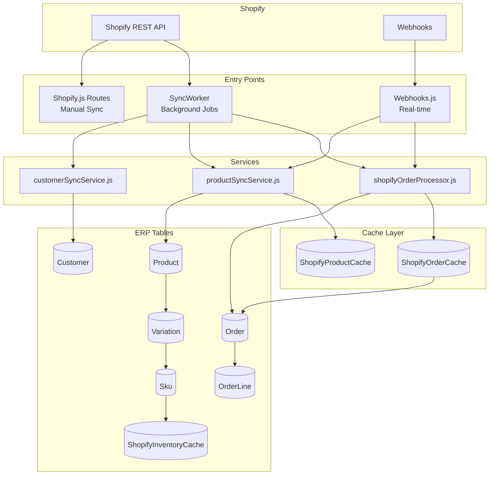
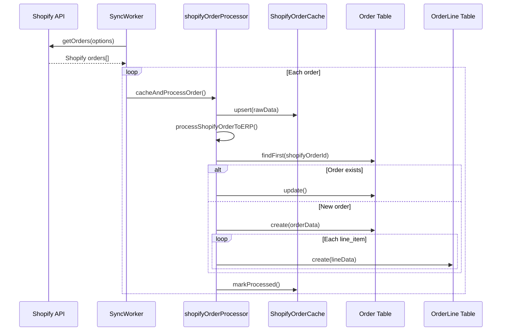
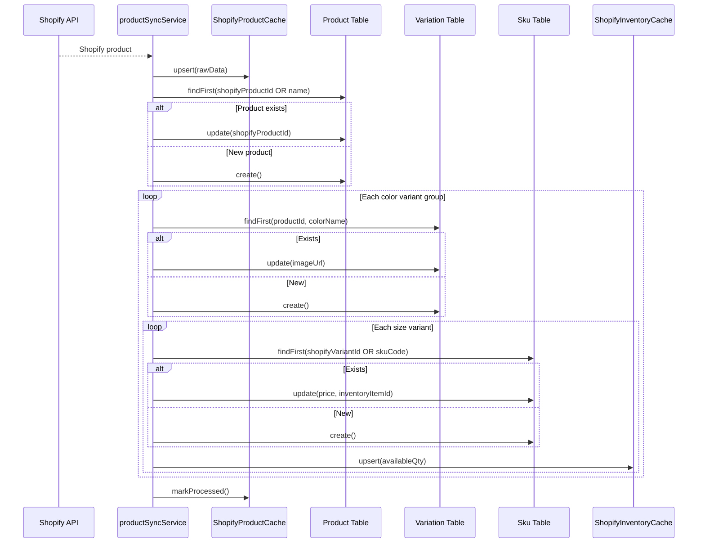
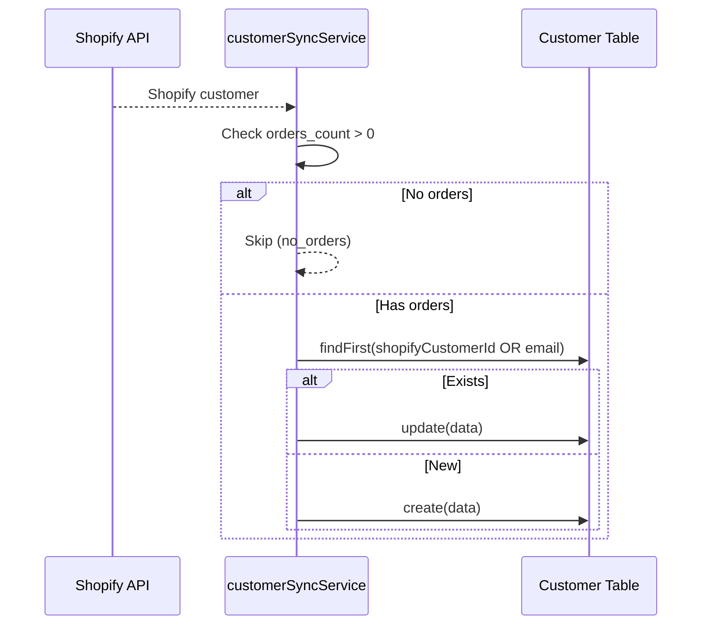

# Shopify Sync Architecture - Deep Dive

## Overview

Three data types synced from Shopify: **Orders**, **Products**, **Customers**. Each uses different strategies optimized for their use case.

---

## System Architecture



---

## Order Sync

### Entry Points

| Entry Point | File | Trigger |
|-------------|------|---------|
| Background Worker | `syncWorker.js` | Manual via Settings UI |
| Webhooks | `webhooks.js` | `orders/create`, `orders/updated`, `orders/paid` |

### Sync Modes (Background Worker)

| Mode | Use Case | API Filter | Skip Logic | Batch Size |
|------|----------|------------|------------|------------|
| **DEEP** | Initial import, recovery | `created_at_min` | None (upsert all) | 250 |
| **QUICK** | Daily catch-up | `created_at_min` from latest DB order | Skip existing IDs | 250 |
| **UPDATE** | Hourly refresh | `updated_at_min` | None (all need updating) | 250 |

### Processing Flow



### Key Functions

| Function | File | Purpose |
|----------|------|---------|
| `processOrderSync()` | syncWorker.js | Background job orchestrator |
| `cacheAndProcessOrder()` | shopifyOrderProcessor.js | Cache-first processing |
| `processShopifyOrderToERP()` | shopifyOrderProcessor.js | Order → ERP mapping |
| `processShopifyOrderWebhook()` | webhooks.js | Webhook handler |

### Table Mappings

| Shopify Field | ERP Table.Column | Notes |
|---------------|------------------|-------|
| `id` | `Order.shopifyOrderId` | Unique identifier |
| `order_number` | `Order.orderNumber` | Display number |
| `customer.id` | `Order.customerId` | FK to Customer |
| `financial_status` | `Order.paymentStatus` | paid/pending/refunded |
| `fulfillment_status` | `Order.status` | open/shipped/delivered |
| `shipping_address` | `Order.shippingAddress` | JSON string |
| `line_items[]` | `OrderLine` | One row per item |
| `line_items[].variant_id` | `OrderLine.skuId` | FK via SKU lookup |

---

## Product Sync

### Entry Points

| Entry Point | File | Trigger |
|-------------|------|---------|
| Background Worker | `syncWorker.js` | Manual via Settings UI |
| Webhooks | `webhooks.js` | `products/create`, `products/update`, `products/delete` |
| Direct Sync | `shopify.js` | Quick sync buttons |

### Processing Flow



### Key Functions

| Function | File | Purpose |
|----------|------|---------|
| `processProductSync()` | syncWorker.js | Background job |
| `cacheAndProcessProduct()` | productSyncService.js | Cache-first processing |
| `syncSingleProduct()` | productSyncService.js | Product → ERP mapping |
| `syncSingleSku()` | productSyncService.js | Variant → SKU mapping |
| `handleProductDeletion()` | productSyncService.js | Soft delete on webhook |

### Table Mappings

| Shopify Field | ERP Table.Column | Notes |
|---------------|------------------|-------|
| `id` | `Product.shopifyProductId` | Unique identifier |
| `title` | `Product.name` | Product name |
| `handle` | `Product.shopifyHandle` | URL-safe slug |
| `product_type` | `Product.category` | Normalized |
| `variants[].option1` | `Variation.colorName` | Grouped by color |
| `variants[].id` | `Sku.shopifyVariantId` | Links variant to SKU |
| `variants[].sku` | `Sku.skuCode` | Fallback identifier |
| `variants[].price` | `Sku.mrp` | Retail price |
| `variants[].inventory_item_id` | `Sku.shopifyInventoryItemId` | For inventory sync |
| `variants[].inventory_quantity` | `ShopifyInventoryCache.availableQty` | Cached qty |

---

## Customer Sync

### Entry Points

| Entry Point | File | Trigger |
|-------------|------|---------|
| Background Worker | `syncWorker.js` | Manual via Settings UI |
| Order Processing | `shopifyOrderProcessor.js` | Creates customer if missing |

### Processing Flow



### Key Functions

| Function | File | Purpose |
|----------|------|---------|
| `processCustomerSync()` | syncWorker.js | Background job |
| `syncSingleCustomer()` | customerSyncService.js | Customer → ERP mapping |
| `buildCustomerData()` | customerSyncService.js | Field extraction |

### Table Mappings

| Shopify Field | ERP Table.Column | Notes |
|---------------|------------------|-------|
| `id` | `Customer.shopifyCustomerId` | Unique identifier |
| `email` | `Customer.email` | Lowercase normalized |
| `phone` | `Customer.phone` | Optional |
| `first_name` | `Customer.firstName` | |
| `last_name` | `Customer.lastName` | |
| `default_address` | `Customer.defaultAddress` | JSON string |
| `tags` | `Customer.tags` | For segmentation |
| `accepts_marketing` | `Customer.acceptsMarketing` | Boolean |

---

## Inventory Sync

### Entry Point

| Entry Point | File | Trigger |
|-------------|------|---------|
| Webhook | `webhooks.js` | `inventory_levels/update` |

### Flow

```javascript
// webhooks.js - inventory_levels/update handler
const { inventory_item_id, available } = req.body;

const sku = await prisma.sku.findFirst({
    where: { shopifyInventoryItemId: String(inventory_item_id) }
});

if (sku) {
    await prisma.shopifyInventoryCache.upsert({
        where: { skuId: sku.id },
        update: { availableQty: available, lastSynced: new Date() },
        create: { skuId: sku.id, shopifyInventoryItemId, availableQty: available }
    });
}
```

---

## Webhook Registration

Required webhooks to register in Shopify Admin:

| Topic | Endpoint | Handler |
|-------|----------|---------|
| `orders/create` | `/api/webhooks/shopify/orders` | `cacheAndProcessOrder` |
| `orders/updated` | `/api/webhooks/shopify/orders` | `cacheAndProcessOrder` |
| `orders/paid` | `/api/webhooks/shopify/orders` | `cacheAndProcessOrder` |
| `products/create` | `/api/webhooks/shopify/products/create` | `cacheAndProcessProduct` |
| `products/update` | `/api/webhooks/shopify/products/update` | `cacheAndProcessProduct` |
| `products/delete` | `/api/webhooks/shopify/products/delete` | `handleProductDeletion` |
| `inventory_levels/update` | `/api/webhooks/shopify/inventory_levels/update` | Direct upsert |

---

## Cache Tables

### ShopifyOrderCache

| Column | Type | Purpose |
|--------|------|---------|
| `id` | String | shopifyOrderId |
| `rawData` | String | Complete JSON |
| `orderNumber` | String | For quick lookup |
| `processedAt` | DateTime | When processed to ERP |
| `processingError` | String | Last error if any |
| `lastWebhookAt` | DateTime | Most recent webhook |

### ShopifyProductCache

| Column | Type | Purpose |
|--------|------|---------|
| `id` | String | shopifyProductId |
| `rawData` | String | Complete JSON |
| `title` | String | For quick lookup |
| `handle` | String | URL-safe identifier |
| `processedAt` | DateTime | When processed |
| `processingError` | String | Last error |

---

## Error Handling

| Scenario | Behavior |
|----------|----------|
| SKU not found | Order created, line skipped, logged in `errorLog` |
| Customer missing | Auto-created from order data |
| API rate limit | Batch delay (500-1500ms) |
| Job cancelled | Checkpoint saved, can resume |
| Server crash | Checkpoint in DB, can resume |
