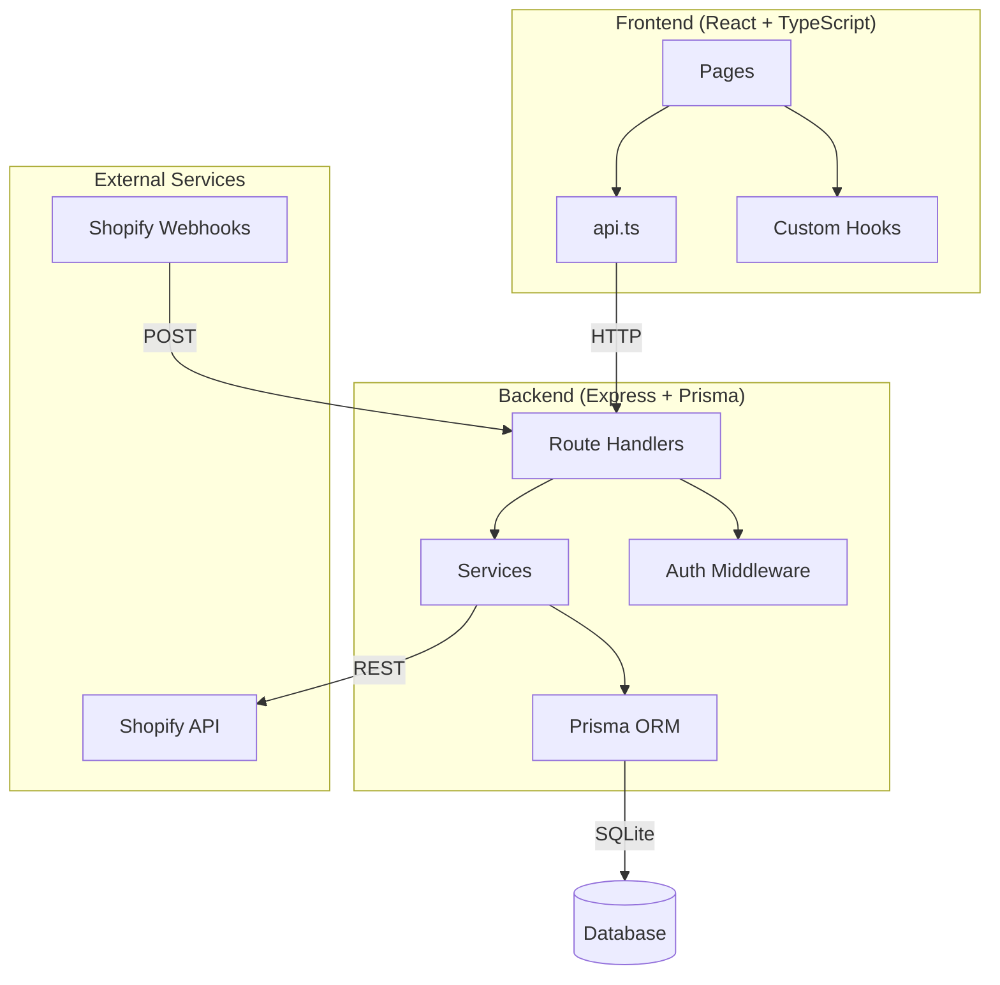
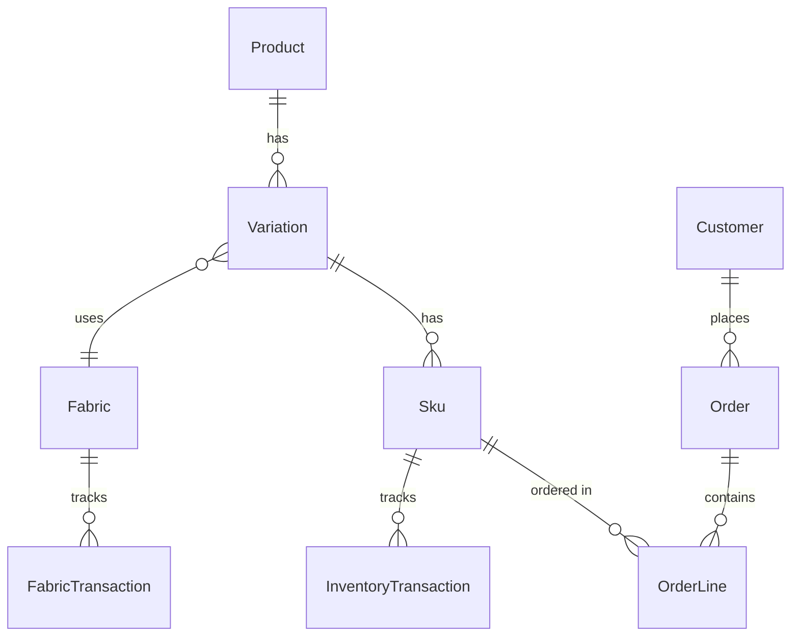
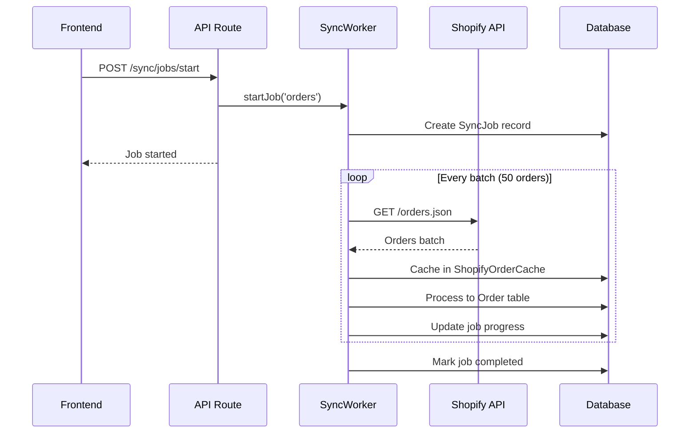

# COH-ERP2 Technical Overview

A comprehensive guide for new team members to understand the Creatures of Habit ERP system.

---

## Table of Contents
1. [System Architecture](#system-architecture)
2. [Project Structure](#project-structure)
3. [Data Models](#data-models)
4. [API Endpoints](#api-endpoints)
5. [Frontend Pages](#frontend-pages)
6. [Key Services](#key-services)
7. [Shopify Integration](#shopify-integration)
8. [Development Setup](#development-setup)

---

## System Architecture



### Tech Stack

| Layer | Technology |
|-------|------------|
| Frontend | React 18, TypeScript, TanStack Query, Lucide Icons |
| Routing | React Router v6 |
| Styling | TailwindCSS |
| Backend | Express.js, Node.js |
| ORM | Prisma |
| Database | SQLite (development), PostgreSQL (production) |
| Auth | JWT tokens with bcrypt |

---

## Project Structure

```
COH-ERP2/
├── client/                    # React frontend
│   ├── src/
│   │   ├── pages/            # 13 page components
│   │   ├── components/       # Reusable UI components
│   │   ├── hooks/            # useAuth, custom hooks
│   │   ├── services/api.ts   # Centralized API client
│   │   └── types/            # TypeScript interfaces
│   └── package.json
│
├── server/                    # Express backend
│   ├── src/
│   │   ├── routes/           # 14 route files
│   │   ├── services/         # Business logic services
│   │   ├── middleware/       # Auth middleware
│   │   ├── utils/            # Helpers, encryption, validation
│   │   └── index.js          # App entry point
│   └── prisma/
│       └── schema.prisma     # Database schema (672 lines, 25+ models)
│
└── docs/                      # Documentation
```

---

## Data Models

### Core Entity Relationships



### Key Models

| Model | Purpose | Key Fields |
|-------|---------|------------|
| `Product` | Master product (e.g., "Linen Midi Dress") | name, styleCode, category |
| `Variation` | Color variant | colorName, fabricId |
| `Sku` | Sellable unit (size variant) | skuCode, size, mrp |
| `Order` | Customer order | orderNumber, status, shopifyOrderId |
| `OrderLine` | Line item in order | skuId, qty, lineStatus |
| `Fabric` | Raw material | colorName, costPerUnit, balance |
| `FabricTransaction` | Fabric ledger entry | txnType, qty, reason |
| `InventoryTransaction` | SKU inventory ledger | txnType, qty, reason |
| `Customer` | Customer record | email, shopifyCustomerId |

---

## API Endpoints

### Route Files (14 total)

| File | Prefix | Description | LOC |
|------|--------|-------------|-----|
| `orders.js` | `/api/orders` | Order CRUD, fulfillment workflow | ~1200 |
| `shopify.js` | `/api/shopify` | Sync, config, background jobs | ~850 |
| `fabrics.js` | `/api/fabrics` | Fabric management, reconciliation | ~800 |
| `production.js` | `/api/production` | Production planning, batches | ~600 |
| `admin.js` | `/api/admin` | User management, settings | ~600 |
| `inventory.js` | `/api/inventory` | Stock management | ~400 |
| `customers.js` | `/api/customers` | Customer CRUD | ~400 |
| `products.js` | `/api/products` | Product catalog | ~350 |
| `webhooks.js` | `/api/webhooks` | Shopify webhook handlers | ~400 |
| `auth.js` | `/api/auth` | Login, registration | ~200 |
| `returns.js` | `/api/returns` | Return requests | ~200 |
| `import-export.js` | `/api/import-export` | CSV data import/export | ~500 |

### Common Patterns

```javascript
// All routes use authenticateToken middleware
router.get('/endpoint', authenticateToken, async (req, res) => {
    const { prisma } = req;  // Prisma client attached to request
    const { user } = req;    // Authenticated user
    // ... handler logic
});
```

---

## Frontend Pages

| Page | File | Purpose |
|------|------|---------|
| Dashboard | `Dashboard.tsx` | Overview metrics, alerts |
| Orders | `Orders.tsx` | Order management, fulfillment |
| Products | `Products.tsx` | Product catalog management |
| Inventory | `Inventory.tsx` | SKU stock levels, transactions |
| Fabrics | `Fabrics.tsx` | Fabric inventory, types, suppliers |
| Fabric Count | `FabricReconciliation.tsx` | Physical stock reconciliation |
| Production | `Production.tsx` | Production planning, batches |
| Customers | `Customers.tsx` | Customer database |
| Returns | `Returns.tsx` | Return request handling |
| Ledgers | `Ledgers.tsx` | Transaction history view |
| Picklist | `Picklist.tsx` | Order picking workflow |
| Settings | `Settings.tsx` | System configuration |

### Data Fetching Pattern

All pages use TanStack Query (React Query):

```typescript
const { data, isLoading } = useQuery({
    queryKey: ['orders', filter],
    queryFn: () => ordersApi.getOpen().then(r => r.data)
});

const mutation = useMutation({
    mutationFn: (data) => ordersApi.update(data),
    onSuccess: () => queryClient.invalidateQueries(['orders'])
});
```

---

## Key Services

### Backend Services (`server/src/services/`)

| Service | Purpose |
|---------|---------|
| `syncWorker.js` | Background job processing for Shopify sync |
| `shopify.js` | Shopify API client wrapper |
| `shopifyOrderProcessor.js` | Order cache + ERP processing |
| `productSyncService.js` | Product sync from Shopify |
| `customerSyncService.js` | Customer sync from Shopify |

### Sync Worker Flow



---

## Shopify Integration

### Data Flow

1. **Webhook-driven** (real-time): `orders/create`, `orders/updated`
2. **Bulk sync** (on-demand): Background job via SyncWorker
3. **Cache layer**: `ShopifyOrderCache` stores raw JSON for replay

### Key Tables

| Table | Purpose |
|-------|---------|
| `ShopifyOrderCache` | Raw webhook/API data for reprocessing |
| `Order.shopifyOrderId` | Link to Shopify order |
| `Sku.shopifyVariantId` | Link to Shopify variant |
| `Customer.shopifyCustomerId` | Link to Shopify customer |

### Webhook Endpoints

```
POST /api/webhooks/orders/create
POST /api/webhooks/orders/updated  
POST /api/webhooks/orders/cancelled
POST /api/webhooks/customers/create
POST /api/webhooks/customers/update
```

---

## Development Setup

### Prerequisites
- Node.js 18+
- npm or yarn

### Quick Start

```bash
# Install dependencies
npm install
cd client && npm install
cd ../server && npm install

# Setup database
cd server && npx prisma db push

# Run development
cd server && npm run dev    # Backend on :3001
cd client && npm run dev    # Frontend on :5173
```

### Environment Variables

```env
# server/.env
DATABASE_URL="file:./dev.db"
JWT_SECRET="your-secret-key"
ENCRYPTION_KEY="32-char-encryption-key"
```

### Test Accounts

| Email | Password | Role |
|-------|----------|------|
| admin@coh.com | admin123 | admin |
| staff@coh.com | staff123 | staff |

---

## Quick Reference

### Order Status Flow
```
open → shipped → delivered
  ↓
cancelled
```

### Order Line Status Flow
```
pending → allocated → picked → packed → shipped
```

### Inventory Transaction Types
- `inward`: production, return_receipt, adjustment
- `outward`: sale, damage, adjustment

### Fabric Transaction Types
- `inward`: supplier_receipt, reconciliation_found
- `outward`: production, shrinkage, reconciliation_shrinkage
