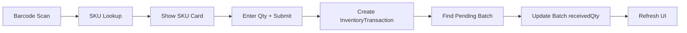

# Production Inward Page

## Overview

Dedicated page for warehouse team to inward production pieces using barcode scanner. Integrates with inventory and production queue.

---

## User Flow

```
1. Scan barcode → SKU lookup
2. Confirm quantity → Create inward transaction
3. Auto-match → Set off against production batch
4. View history → Edit/delete if incorrect
```

---

## UI Design

```
┌─────────────────────────────────────────────────────────────────┐
│  📦 Production Inward                                          │
├─────────────────────────────────────────────────────────────────┤
│                                                                 │
│  ┌──────────────────────────────────────┐                      │
│  │ 🔍 Scan Barcode or Enter SKU         │  [Auto-focus]       │
│  └──────────────────────────────────────┘                      │
│                                                                 │
│  ┌─────────────────────────────────────────────────────────────┐
│  │ SKU: DRESS-RED-M                   Qty: [  5  ] [+ Inward] │
│  │ Product: Summer Dress - Red / Medium                        │
│  │ Pending in Production: 12 pcs                               │
│  │ Current Stock: 8 pcs                                        │
│  │ ┌──────────┐                                                │
│  │ │  IMAGE   │                                                │
│  │ └──────────┘                                                │
│  └─────────────────────────────────────────────────────────────┘
│                                                                 │
│  ─────────────── Recent Inwards (Today) ───────────────────    │
│                                                                 │
│  │ Time   │ SKU              │ Qty │ Batch       │ Actions   │ │
│  │ 14:32  │ DRESS-RED-M      │ +5  │ B-2024-001  │ ✏️ 🗑️      │ │
│  │ 14:28  │ SHIRT-BLUE-L     │ +10 │ B-2024-003  │ ✏️ 🗑️      │ │
│  │ 14:15  │ PANTS-BLACK-S    │ +3  │ -           │ ✏️ 🗑️      │ │
│                                                                 │
└─────────────────────────────────────────────────────────────────┘
```

---

## Features

### 1. Barcode Scan Input
- Auto-focus on page load
- Listen for barcode scanner input (ends with Enter)
- Support SKU code or barcode

### 2. SKU Preview Card
- Product name, image, color, size
- Current stock level
- Pending production quantity
- Matching production batches

### 3. Quick Inward
- Quantity input (default: 1)
- One-click inward button
- Auto-refresh after success

### 4. Production Batch Matching
- Find pending batches for same SKU
- Auto-decrement batch remaining quantity
- Mark batch complete if fully received

### 5. Inward History
- Today's inwards by default
- Edit quantity on recent inwards
- Delete incorrect entries (with confirmation)

---

## API Endpoints

### Existing
- `GET /api/products/skus/all` - SKU lookup
- `POST /api/inventory/quick-inward` - Create inward

### New/Modify
- `GET /api/inventory/inward-history?date=today` - Recent inwards
- `PUT /api/inventory/inward/:id` - Edit inward quantity
- `DELETE /api/inventory/inward/:id` - Delete inward
- `GET /api/production/pending-by-sku/:skuId` - Pending batches

---

## Data Flow



---

## Schema Changes

### No Changes Required
Existing models support this:
- `InventoryTransaction` - tracks inwards
- `ProductionBatch` - has `receivedQty` field
- `Sku` - has `barcode` field

---

## Implementation Checklist

### Backend
- [ ] Add `GET /inventory/inward-history` endpoint
- [ ] Add `PUT /inventory/inward/:id` for editing
- [ ] Add `DELETE /inventory/inward/:id` for deletion
- [ ] Add `GET /production/pending-by-sku/:skuId`
- [ ] Update `quick-inward` to match production batches

### Frontend
- [ ] Create `InwardPage.tsx` component
- [ ] Add barcode scanner input handler
- [ ] SKU preview card with image
- [ ] Inward history table with edit/delete
- [ ] Add to navigation menu

### UX
- [ ] Auto-focus input on page load
- [ ] Success toast with batch match info
- [ ] Confirmation dialog for delete
- [ ] Mobile-friendly layout

---

## Matching Logic

```javascript
async function matchProductionBatch(prisma, skuId, quantity) {
    // Find oldest pending batch for this SKU
    const batch = await prisma.productionBatch.findFirst({
        where: {
            skuId,
            status: 'in_progress',
            receivedQty: { lt: prisma.raw('quantity') }
        },
        orderBy: { batchDate: 'asc' }
    });
    
    if (batch) {
        const newReceived = batch.receivedQty + quantity;
        await prisma.productionBatch.update({
            where: { id: batch.id },
            data: {
                receivedQty: newReceived,
                status: newReceived >= batch.quantity ? 'completed' : 'in_progress'
            }
        });
        return batch;
    }
    return null;
}
```
