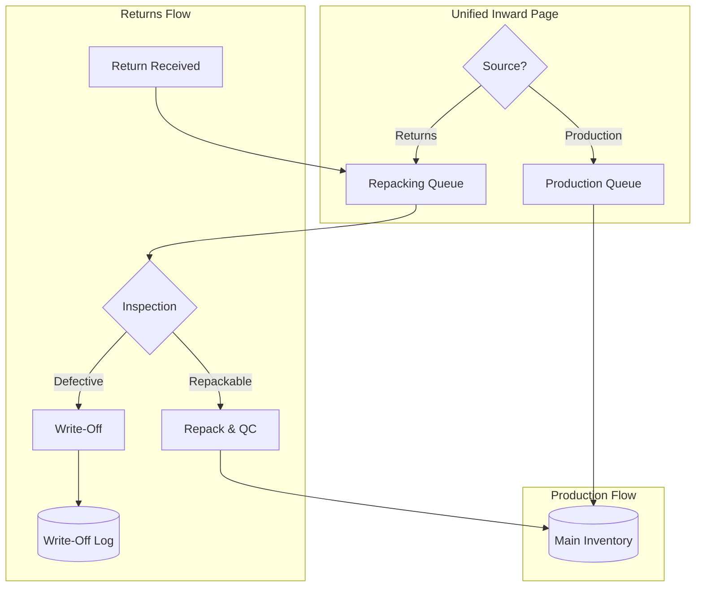
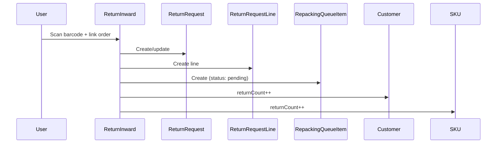
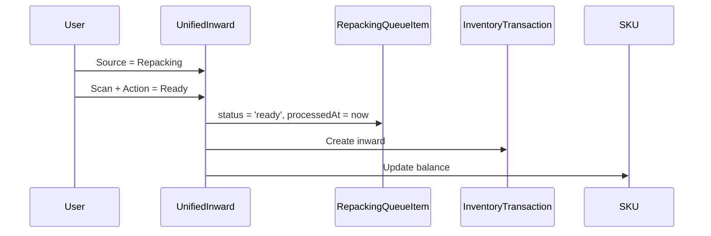
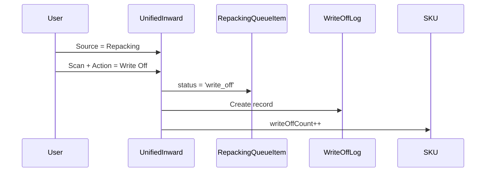

# Return/Exchange Inward Page

## Overview

Dedicated page for receiving returned/exchanged items via barcode scan. Items go to a **Repacking Queue** (not main inventory) and can be marked as ready, defective, or destroyed.

---

## Architecture



---

## Schema Changes

### New: Repacking Queue

```prisma
model RepackingQueueItem {
  id              String   @id @default(uuid())
  skuId           String
  qty             Int      @default(1)
  returnRequestId String?  // Link to return that created this
  returnLineId    String?  // Specific line
  status          String   @default("pending")  
                           // pending, inspecting, repacking, ready, write_off
  condition       String   // unused, used, damaged, defective, destroyed
  inspectionNotes String?
  writeOffReason  String?  // size_issue, quality_defect, destroyed, wrong_product
  createdAt       DateTime @default(now())
  processedAt     DateTime?
  processedById   String?
  
  sku           Sku            @relation(fields: [skuId], references: [id])
  returnRequest ReturnRequest? @relation(fields: [returnRequestId], references: [id])
  processedBy   User?          @relation(fields: [processedById], references: [id])
  
  @@index([skuId])
  @@index([status])
  @@index([returnRequestId])
}
```

### New: Write-Off Log

```prisma
model WriteOffLog {
  id              String   @id @default(uuid())
  skuId           String
  qty             Int
  reason          String   // defective, destroyed, wrong_product, expired, other
  sourceType      String   // return, production, inventory_audit
  sourceId        String?  // RepackingQueueItem.id or other reference
  notes           String?
  costValue       Float?   // For financial tracking
  createdById     String
  createdAt       DateTime @default(now())
  
  sku       Sku  @relation(fields: [skuId], references: [id])
  createdBy User @relation(fields: [createdById], references: [id])
  
  @@index([skuId])
  @@index([reason])
  @@index([createdAt])
}
```

### Update: Customer, SKU, Product Stats

```prisma
model Customer {
  returnCount     Int @default(0)
  exchangeCount   Int @default(0)
}

model Sku {
  returnCount     Int @default(0)
  exchangeCount   Int @default(0)
  writeOffCount   Int @default(0)
}

model Product {
  returnCount     Int @default(0)
  exchangeCount   Int @default(0)
  writeOffCount   Int @default(0)
}
```

---

## UI Design: Unified Inward Page

```
┌─────────────────────────────────────────────────────────────────┐
│  📦 Inward                                                      │
├─────────────────────────────────────────────────────────────────┤
│                                                                 │
│  Source: [● Production Queue] [○ Repacking Queue]              │
│                                                                 │
│  ┌──────────────────────────────────────┐                      │
│  │ 🔍 Scan Barcode or Enter SKU         │                      │
│  └──────────────────────────────────────┘                      │
│                                                                 │
│  ┌─────────────────────────────────────────────────────────────┐
│  │ SKU: DRESS-RED-M                                            │
│  │ Product: Summer Dress - Red / Medium                        │
│  │ ┌──────────┐  Pending in Production: 12                     │
│  │ │  IMAGE   │  Pending in Repacking: 3                       │
│  │ └──────────┘  Current Stock: 45                             │
│  └─────────────────────────────────────────────────────────────┘
│                                                                 │
│  ┌─ If Production ──────────────────────────────────────────┐  │
│  │ Qty: [  5  ]  [▶ Inward to Stock]                        │  │
│  └──────────────────────────────────────────────────────────┘  │
│                                                                 │
│  ┌─ If Repacking ───────────────────────────────────────────┐  │
│  │ Qty: [  1  ]                                             │  │
│  │                                                          │  │
│  │ Action:                                                  │  │
│  │   ● Ready for Stock (repacked, QC passed)               │  │
│  │   ○ Write Off (defective/destroyed)                     │  │
│  │                                                          │  │
│  │ If Write Off:                                            │  │
│  │   Reason: [Defective ▼]                                  │  │
│  │   Notes: [________________]                              │  │
│  │                                                          │  │
│  │ [▶ Process]                                              │  │
│  └──────────────────────────────────────────────────────────┘  │
│                                                                 │
└─────────────────────────────────────────────────────────────────┘
```

---

## UI Design: Return Inward (Adds to Repacking Queue)

```
┌─────────────────────────────────────────────────────────────────┐
│  📦 Return Inward                                               │
├─────────────────────────────────────────────────────────────────┤
│                                                                 │
│  ┌──────────────────────────────────────┐                      │
│  │ 🔍 Scan Barcode                      │                      │
│  └──────────────────────────────────────┘                      │
│                                                                 │
│  ─────────────── Link to Order ────────────────────────────    │
│  Order #: [_____________] [🔍 Search]                          │
│                                                                 │
│  ─────────────── Return Details ───────────────────────────    │
│  Type:   ● Return   ○ Exchange                                 │
│  Reason: [Size Issue ▼]                                        │
│  Condition: ○ Unused  ○ Used  ○ Damaged  ○ Defective           │
│                                                                 │
│  [✓ Add to Repacking Queue]                                    │
│                                                                 │
│  ✅ Added DRESS-RED-M to repacking queue                       │
│     → Condition: Used                                          │
│     → Linked to Order #1234                                    │
│                                                                 │
└─────────────────────────────────────────────────────────────────┘
```

---

## Data Flows

### Flow 1: Return Received → Repacking Queue



### Flow 2: Repacking → Ready for Stock



### Flow 3: Repacking → Write Off



---

## Write-Off Reasons

| Reason | Description |
|--------|-------------|
| `defective` | Manufacturing or quality defect |
| `destroyed` | Damaged beyond repair during return |
| `wrong_product` | Customer returned wrong item |
| `expired` | Past usability (for applicable products) |
| `other` | Free text in notes |

---

## API Endpoints

| Method | Endpoint | Purpose |
|--------|----------|---------|
| `POST` | `/api/returns/inward` | Receive return → Repacking Queue |
| `GET` | `/api/repacking/queue` | List pending repacking items |
| `POST` | `/api/repacking/process` | Move to stock or write-off |
| `GET` | `/api/write-offs` | Write-off history |
| `GET` | `/api/write-offs/stats` | Aggregated write-off stats |

---

## Implementation Checklist

### Schema
- [ ] Create `RepackingQueueItem` model
- [ ] Create `WriteOffLog` model
- [ ] Add stats fields to Customer, SKU, Product
- [ ] Run migration

### Backend
- [ ] `POST /returns/inward` - Add to repacking queue
- [ ] `GET /repacking/queue` - List items
- [ ] `POST /repacking/process` - Stock or write-off
- [ ] `GET /write-offs` - History with filters
- [ ] Update stats on each action

### Frontend
- [ ] Unified Inward page with source toggle
- [ ] Return Inward page (links to orders)
- [ ] Repacking Queue view
- [ ] Write-off modal with reason selection
- [ ] Write-off reports page
