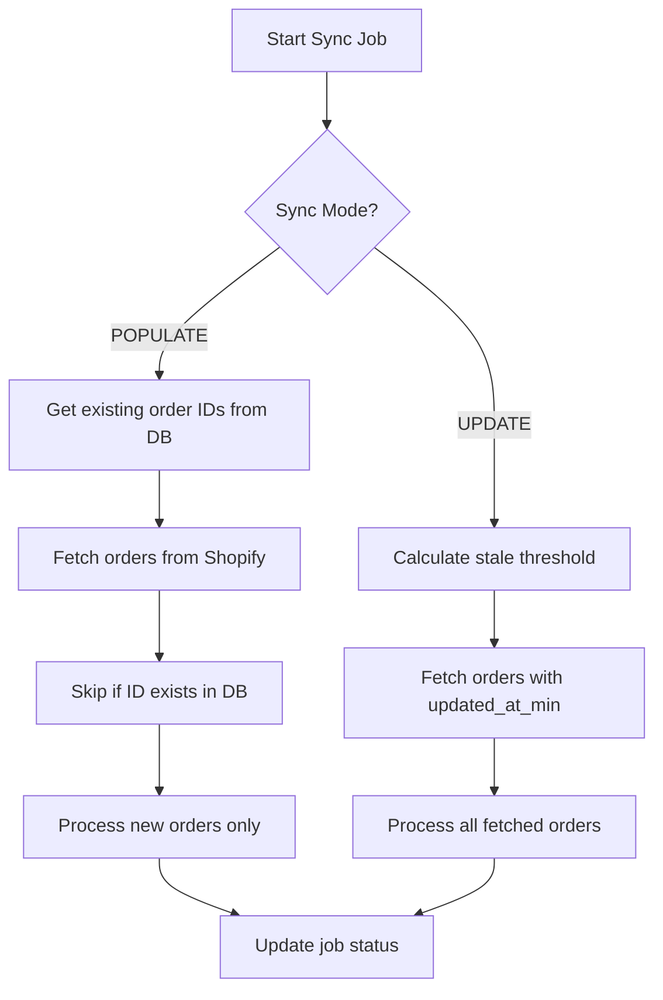

# Shopify Sync Improvements Plan

## Overview

Implement two distinct sync modes for orders:

| Mode | Purpose | Behavior |
|------|---------|----------|
| **POPULATE** | Initial import | Import new orders, skip existing |
| **UPDATE** | Refresh stale data | Re-sync orders not updated in X time |

---

## Current State

The existing `SyncWorker` has a single sync mode that:
- Fetches orders using `since_id` pagination
- Uses `cacheAndProcessOrder()` which upserts (creates or updates)
- No distinction between "populate" and "update"
- Re-syncs all orders every time (wasteful)

---

## Proposed Changes

### 1. Add Sync Mode to Job

#### [MODIFY] schema.prisma

```prisma
model SyncJob {
  // ... existing fields
  syncMode    String?   // 'populate' | 'update'
  staleAfterMins Int?   // For update mode: re-sync if older than X mins
}
```

---

### 2. POPULATE Mode (New Orders Only)

**Logic**: Skip orders that already exist in database.

```javascript
async processOrderSync(jobId) {
  const job = await prisma.syncJob.findUnique({ where: { id: jobId } });
  
  if (job.syncMode === 'populate') {
    // Get existing Shopify order IDs
    const existingIds = await prisma.order.findMany({
      where: { shopifyOrderId: { not: null } },
      select: { shopifyOrderId: true }
    });
    const existingSet = new Set(existingIds.map(o => o.shopifyOrderId));
    
    for (const shopifyOrder of batch) {
      if (existingSet.has(String(shopifyOrder.id))) {
        // Skip - already exists
        skipped++;
        continue;
      }
      // Process new order
      await cacheAndProcessOrder(prisma, shopifyOrder, 'populate_sync');
    }
  }
}
```

**API Endpoint**:
```
POST /api/shopify/sync/jobs/start
{
  "jobType": "orders",
  "syncMode": "populate",
  "days": 365
}
```

---

### 3. UPDATE Mode (Stale Orders)

Uses Shopify's `updated_at_min` parameter to fetch only orders changed since the threshold—avoiding full scans.

```javascript
if (job.syncMode === 'update') {
  const staleThreshold = new Date();
  staleThreshold.setMinutes(staleThreshold.getMinutes() - job.staleAfterMins);
  
  // Only fetch orders updated in Shopify since threshold
  const shopifyOrders = await shopifyClient.getOrders({
    updated_at_min: staleThreshold.toISOString(),
    status: 'any'
  });
  
  // Process all - they all need updating
  for (const order of shopifyOrders) {
    await cacheAndProcessOrder(prisma, order, 'update_sync');
  }
}
```

**API Endpoint**:
```
POST /api/shopify/sync/jobs/start
{
  "jobType": "orders",
  "syncMode": "update",
  "staleAfterMins": 60
}
```

**Benefits**:
- Fewer Shopify API calls (~5 vs ~240)
- Faster execution (~1 min vs ~30 min)
- Lower memory usage

---

## Implementation Checklist

### Backend
- [ ] Add `syncMode` and `staleAfterMins` to `SyncJob` schema
- [ ] Modify `syncWorker.startJob()` to accept new options
- [ ] Add POPULATE logic with existing ID lookup
- [ ] Add UPDATE logic with `updated_at_min` parameter
- [ ] Update job logging to show mode-specific stats

### API
- [ ] Update `/sync/jobs/start` endpoint to accept `syncMode`
- [ ] Add validation for mode-specific required fields
- [ ] Update `/sync/jobs` list to show sync mode

### Frontend (Optional)
- [ ] Add mode selector in Settings → Shopify sync UI
- [ ] Show mode in job history table

---

## Data Flow



---

## Expected Behavior

| Scenario | POPULATE Mode | UPDATE Mode |
|----------|---------------|-------------|
| Order exists, unchanged | Skip | Skip (not in Shopify response) |
| Order exists, changed in Shopify | Skip | Update |
| Order does not exist | Create | Create |
| API calls to Shopify | Full scan | Incremental (updated_at_min) |

---

## Performance Estimates

| Mode | 60K Orders | API Calls | Time |
|------|------------|-----------|------|
| POPULATE (first run) | All new | ~240 | ~30 min |
| POPULATE (subsequent) | Few new | ~10 | ~2 min |
| UPDATE (hourly) | ~100 updated | ~1-5 | ~1 min |

---

## Migration

No breaking changes. Existing sync behavior remains the default if `syncMode` is not specified.
