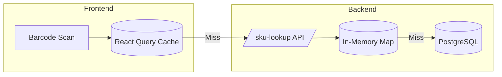

# SKU & Order Cache for Fast Lookup

## Overview

Implement in-memory caching for SKU and Order data to enable sub-millisecond lookups in inward pages (Production Inward, Return Inward).

---

## Architecture



---

## Implementation

### 1. Server-Side Cache

#### [NEW] server/src/lib/skuCache.js

```javascript
/**
 * In-memory SKU cache for fast barcode lookups
 * Automatically refreshes when stale
 */

let skuCache = new Map();
let lastRefreshAt = null;
let isRefreshing = false;
const CACHE_TTL_MS = 60000; // 1 minute

/**
 * Load all SKUs into memory
 */
export async function loadSkuCache(prisma) {
    if (isRefreshing) return;
    isRefreshing = true;
    
    try {
        const skus = await prisma.sku.findMany({
            select: {
                id: true,
                skuCode: true,
                barcode: true,
                size: true,
                mrp: true,
                shopifyVariantId: true,
                variation: {
                    select: {
                        id: true,
                        colorName: true,
                        imageUrl: true,
                        product: {
                            select: {
                                id: true,
                                name: true,
                                imageUrl: true,
                            }
                        }
                    }
                }
            }
        });
        
        const newCache = new Map();
        for (const sku of skus) {
            const entry = {
                ...sku,
                productName: sku.variation?.product?.name,
                colorName: sku.variation?.colorName,
                imageUrl: sku.variation?.imageUrl || sku.variation?.product?.imageUrl,
            };
            
            // Index by multiple keys
            newCache.set(sku.skuCode.toLowerCase(), entry);
            if (sku.barcode) newCache.set(sku.barcode, entry);
            if (sku.shopifyVariantId) newCache.set(sku.shopifyVariantId, entry);
        }
        
        skuCache = newCache;
        lastRefreshAt = Date.now();
        console.log(`[SkuCache] Loaded ${skuCache.size} entries`);
    } finally {
        isRefreshing = false;
    }
}

/**
 * Lookup SKU by barcode, skuCode, or variantId
 */
export function lookupSku(key) {
    if (!key) return null;
    return skuCache.get(key.toLowerCase()) || skuCache.get(key);
}

/**
 * Get cache stats
 */
export function getCacheStats() {
    return {
        size: skuCache.size,
        lastRefreshAt,
        ageMs: lastRefreshAt ? Date.now() - lastRefreshAt : null,
    };
}

/**
 * Refresh cache if stale
 */
export async function refreshIfStale(prisma) {
    if (!lastRefreshAt || Date.now() - lastRefreshAt > CACHE_TTL_MS) {
        // Don't await - refresh in background
        loadSkuCache(prisma).catch(console.error);
    }
}

/**
 * Invalidate cache (call after SKU create/update/delete)
 */
export function invalidateCache() {
    lastRefreshAt = null;
}
```

---

### 2. API Endpoint

#### [MODIFY] server/src/routes/inventory.js

```javascript
import { lookupSku, refreshIfStale, getCacheStats, loadSkuCache } from '../lib/skuCache.js';

// Fast SKU lookup endpoint
router.get('/sku-lookup', authenticateToken, async (req, res) => {
    try {
        const { code } = req.query;
        if (!code) return res.status(400).json({ error: 'Code required' });
        
        // Trigger background refresh if stale
        refreshIfStale(req.prisma);
        
        const sku = lookupSku(code);
        if (sku) {
            return res.json(sku);
        }
        
        // Cache miss - try DB directly
        const dbSku = await req.prisma.sku.findFirst({
            where: {
                OR: [
                    { skuCode: code },
                    { barcode: code },
                    { shopifyVariantId: code },
                ]
            },
            include: {
                variation: { include: { product: true } }
            }
        });
        
        if (dbSku) {
            return res.json(dbSku);
        }
        
        res.status(404).json({ error: 'SKU not found' });
    } catch (error) {
        res.status(500).json({ error: error.message });
    }
});

// Cache stats endpoint (admin)
router.get('/sku-cache-stats', authenticateToken, async (req, res) => {
    res.json(getCacheStats());
});

// Force cache refresh
router.post('/sku-cache-refresh', authenticateToken, async (req, res) => {
    await loadSkuCache(req.prisma);
    res.json({ success: true, ...getCacheStats() });
});
```

---

### 3. Initialize on Server Start

#### [MODIFY] server/src/index.js

```javascript
import { loadSkuCache } from './lib/skuCache.js';

// After Prisma is ready
loadSkuCache(prisma)
    .then(() => console.log('SKU cache initialized'))
    .catch(console.error);
```

---

### 4. Invalidate on SKU Changes

#### [MODIFY] server/src/routes/products.js (SKU create/update)

```javascript
import { invalidateCache } from '../lib/skuCache.js';

// After SKU create
await req.prisma.sku.create({ ... });
invalidateCache();

// After SKU update
await req.prisma.sku.update({ ... });
invalidateCache();
```

---

### 5. Client-Side Preload (Optional Enhancement)

#### [MODIFY] client/src/pages/ProductionInward.tsx

```tsx
// Preload all SKUs for instant local lookup
const { data: skuLookupMap } = useQuery({
    queryKey: ['sku-lookup-preload'],
    queryFn: async () => {
        const skus = await api.getAllSkus();
        const map = new Map<string, Sku>();
        for (const sku of skus) {
            map.set(sku.skuCode.toLowerCase(), sku);
            if (sku.barcode) map.set(sku.barcode, sku);
        }
        return map;
    },
    staleTime: 5 * 60 * 1000, // 5 min
    gcTime: 10 * 60 * 1000,
});

const handleBarcodeScan = (code: string) => {
    // Try local cache first
    const localSku = skuLookupMap?.get(code.toLowerCase());
    if (localSku) {
        setSelectedSku(localSku);
        return;
    }
    
    // Fall back to API
    skuLookupMutation.mutate(code);
};
```

---

## Order Cache (Last 1000 Orders)

### Purpose

Fast order lookup for Return Inward page - search by order number or customer email/phone.

### [NEW] server/src/lib/orderCache.js

```javascript
/**
 * In-memory cache for recent orders
 * Indexed by orderNumber and customer email/phone for fast lookup
 */

let orderCache = new Map();         // orderNumber -> order
let customerOrderIndex = new Map(); // email/phone -> orderNumber[]
let skuOrderIndex = new Map();      // skuId -> orderNumber[]
let lastRefreshAt = null;
let isRefreshing = false;
const CACHE_TTL_MS = 120000; // 2 minutes
const MAX_ORDERS = 1000;

/**
 * Load recent orders into memory
 */
export async function loadOrderCache(prisma) {
    if (isRefreshing) return;
    isRefreshing = true;
    
    try {
        const orders = await prisma.order.findMany({
            take: MAX_ORDERS,
            orderBy: { orderDate: 'desc' },
            select: {
                id: true,
                orderNumber: true,
                orderDate: true,
                status: true,
                totalAmount: true,
                shopifyOrderId: true,
                customerId: true,
                customer: {
                    select: {
                        id: true,
                        email: true,
                        phone: true,
                        firstName: true,
                        lastName: true,
                    }
                },
                orderLines: {
                    select: {
                        id: true,
                        qty: true,
                        lineStatus: true,
                        sku: {
                            select: {
                                id: true,
                                skuCode: true,
                                size: true,
                                variation: {
                                    select: {
                                        colorName: true,
                                        product: { select: { name: true } }
                                    }
                                }
                            }
                        }
                    }
                }
            }
        });
        
        const newOrderCache = new Map();
        const newCustomerIndex = new Map();
        const newSkuIndex = new Map();
        
        for (const order of orders) {
            // Index by order number
            newOrderCache.set(order.orderNumber, order);
            newOrderCache.set(String(order.orderNumber), order);
            
            // Index by Shopify order ID
            if (order.shopifyOrderId) {
                newOrderCache.set(order.shopifyOrderId, order);
            }
            
            // Index by customer email/phone
            const customer = order.customer;
            if (customer) {
                const keys = [
                    customer.email?.toLowerCase(),
                    customer.phone,
                ].filter(Boolean);
                
                for (const key of keys) {
                    if (!newCustomerIndex.has(key)) {
                        newCustomerIndex.set(key, []);
                    }
                    newCustomerIndex.get(key).push(order.orderNumber);
                }
            }
            
            // Index by SKU ID and skuCode
            for (const line of order.orderLines || []) {
                if (line.sku) {
                    const skuKeys = [line.sku.id, line.sku.skuCode?.toLowerCase()].filter(Boolean);
                    for (const key of skuKeys) {
                        if (!newSkuIndex.has(key)) {
                            newSkuIndex.set(key, []);
                        }
                        newSkuIndex.get(key).push(order.orderNumber);
                    }
                }
            }
        }
        
        orderCache = newOrderCache;
        customerOrderIndex = newCustomerIndex;
        skuOrderIndex = newSkuIndex;
        lastRefreshAt = Date.now();
        console.log(`[OrderCache] Loaded ${orderCache.size} orders, ${skuOrderIndex.size} SKU index entries`);
    } finally {
        isRefreshing = false;
    }
}

/**
 * Lookup order by order number or Shopify ID
 */
export function lookupOrder(orderNumber) {
    if (!orderNumber) return null;
    return orderCache.get(orderNumber) || orderCache.get(String(orderNumber));
}

/**
 * Lookup orders by customer email or phone
 * Returns array of orders
 */
export function lookupOrdersByCustomer(emailOrPhone) {
    if (!emailOrPhone) return [];
    const key = emailOrPhone.toLowerCase();
    const orderNumbers = customerOrderIndex.get(key) || [];
    return orderNumbers.map(num => orderCache.get(num)).filter(Boolean);
}

/**
 * Lookup orders containing a specific SKU
 * @param {string} skuIdOrCode - SKU ID or skuCode
 * Returns array of orders with qty for that SKU
 */
export function lookupOrdersBySku(skuIdOrCode) {
    if (!skuIdOrCode) return [];
    const key = skuIdOrCode.toLowerCase();
    const orderNumbers = skuOrderIndex.get(key) || skuOrderIndex.get(skuIdOrCode) || [];
    return orderNumbers.map(num => {
        const order = orderCache.get(num);
        if (!order) return null;
        // Find qty for this SKU in the order
        const matchingLine = order.orderLines?.find(
            l => l.sku?.id === skuIdOrCode || l.sku?.skuCode?.toLowerCase() === key
        );
        return { ...order, matchedSku: matchingLine?.sku, matchedQty: matchingLine?.qty };
    }).filter(Boolean);
}

/**
 * Search orders (partial match on order number)
 */
export function searchOrders(query, limit = 10) {
    if (!query || query.length < 2) return [];
    const results = [];
    const queryLower = query.toLowerCase();
    
    for (const [key, order] of orderCache.entries()) {
        if (String(key).includes(queryLower)) {
            results.push(order);
            if (results.length >= limit) break;
        }
    }
    return results;
}

export function getOrderCacheStats() {
    return {
        orderCount: orderCache.size,
        customerIndexSize: customerOrderIndex.size,
        skuIndexSize: skuOrderIndex.size,
        lastRefreshAt,
        ageMs: lastRefreshAt ? Date.now() - lastRefreshAt : null,
    };
}

export async function refreshOrderCacheIfStale(prisma) {
    if (!lastRefreshAt || Date.now() - lastRefreshAt > CACHE_TTL_MS) {
        loadOrderCache(prisma).catch(console.error);
    }
}

export function invalidateOrderCache() {
    lastRefreshAt = null;
}
```

---

### Order Cache API Endpoints

#### [MODIFY] server/src/routes/orders.js

```javascript
import { 
    lookupOrder, 
    lookupOrdersByCustomer,
    lookupOrdersBySku,
    searchOrders,
    refreshOrderCacheIfStale 
} from '../lib/orderCache.js';

// Fast order lookup by order number, customer, SKU, or search
router.get('/lookup', authenticateToken, async (req, res) => {
    const { orderNumber, customer, sku, search } = req.query;
    refreshOrderCacheIfStale(req.prisma);
    
    if (orderNumber) {
        const order = lookupOrder(orderNumber);
        return order 
            ? res.json(order) 
            : res.status(404).json({ error: 'Order not found' });
    }
    
    if (customer) {
        const orders = lookupOrdersByCustomer(customer);
        return res.json(orders);
    }
    
    if (sku) {
        const orders = lookupOrdersBySku(sku);
        return res.json(orders);
    }
    
    if (search) {
        const orders = searchOrders(search, 10);
        return res.json(orders);
    }
    
    res.status(400).json({ error: 'Provide orderNumber, customer, or search' });
});
```

---

### Initialize Both Caches on Server Start

#### [MODIFY] server/src/index.js

```javascript
import { loadSkuCache } from './lib/skuCache.js';
import { loadOrderCache } from './lib/orderCache.js';

// After Prisma is ready
Promise.all([
    loadSkuCache(prisma),
    loadOrderCache(prisma),
]).then(() => {
    console.log('Caches initialized');
}).catch(console.error);
```

---

## Performance Comparison

| Approach | Latency | When |
|----------|---------|------|
| DB query | ~50-100ms | Current |
| Server cache (hit) | <1ms | After implementation |
| Client cache (hit) | <0.1ms | With preload |

---

## Memory Usage Estimate

| Data | Count | Approx Memory |
|------|-------|---------------|
| SKUs | 5,000 | ~10 MB |
| Orders | 1,000 | ~5 MB |
| **Total** | | **~15 MB** |

Well within Railway's 512MB+ limits.

---

## Implementation Checklist

### Backend - SKU Cache
- [ ] Create `server/src/lib/skuCache.js`
- [ ] Add `GET /inventory/sku-lookup` endpoint
- [ ] Add `GET /inventory/sku-cache-stats` endpoint
- [ ] Add `POST /inventory/sku-cache-refresh` endpoint
- [ ] Initialize cache on server start
- [ ] Invalidate cache on SKU changes

### Backend - Order Cache
- [ ] Create `server/src/lib/orderCache.js`
- [ ] Add `GET /orders/lookup` endpoint (by number, customer, search)
- [ ] Add `GET /orders/cache-stats` endpoint
- [ ] Initialize cache on server start
- [ ] Invalidate cache on order create/update

### Frontend (Optional)
- [ ] Add SKU preload to inward pages
- [ ] Local Map lookup before API call
- [ ] Add cache refresh button to Settings

### Testing
- [ ] Test barcode scan latency before/after
- [ ] Test order lookup by number and customer
- [ ] Test cache refresh behavior
- [ ] Test cache invalidation
